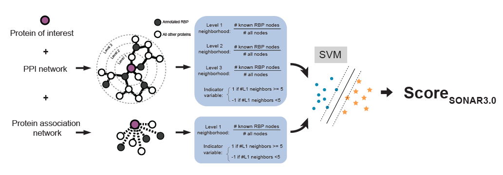
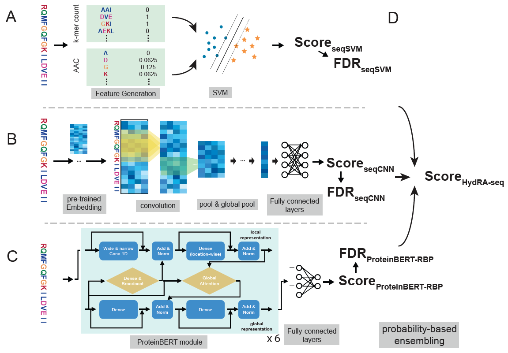
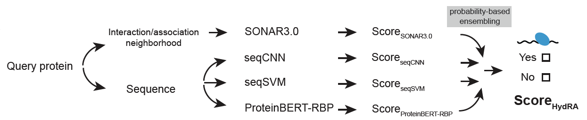
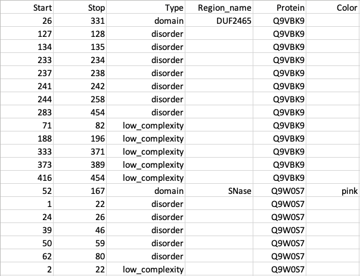
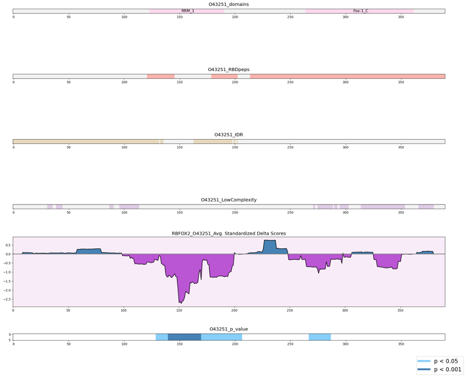

# HydRA: Deep-learning models for predicting RNA-binding capacity from protein interaction association context and protein sequence.
[](https://zenodo.org/badge/latestdoi/582775512)


Paper: [Jin et al., Molecular Cell, 2023](https://www.cell.com/molecular-cell/pdfExtended/S1097-2765(23)00466-5)


 SONAR3.0
 
 HydRA-seq
 
 HydRA
 

# Installation
HydRa is tested to work under Python 3.8. Run the following code in your terminal window to install HydRa. It was recommended to build a new conda environment and do the HydRa installation to avoid messing up your current python environment. An installation tutorial for conda could be found [here](https://docs.conda.io/projects/conda/en/latest/user-guide/install/index.html).

## For Linux user:
```
## Create a conda environment for HydRa, and activate the environment
conda create -n "HydRa" python=3.8.12 -y
conda activate HydRa

## Install the dependency packages for HydRa
pip3 install pandas numpy protobuf==3.20.3 networkx==2.6.3 scikit-learn==0.22.1 tensorflow==2.6.0 keras==2.6.0 matplotlib==3.4.3 setuptools Pygments packaging protein-bert

## Install HydRa
pip3 install hydra-rbp --no-deps
## Alternative command: python3 -m pip install --index-url https://test.pypi.org/simple/ --no-deps --upgrade hydra-rbp
```
Download ProteinBERT-RBP model (i.e. ProteinBERT_TrainWithWholeProteinSet_defaultSetting_ModelFile.pkl.gz) from [here](https://drive.google.com/file/d/1r1xTgizQVFwO28eHz735OjXtoE5vfqhD/view?usp=share_link), uncompress it with gunzip tool and move it into your local directory. Or you could also find the ProteinBERT_TrainWithWholeProteinSet_defaultSetting_ModelFile.pkl in the assets of the Releases v0.1.21.32 in this repository. (If you are Yeo Lab TSCC user, skip this step.) 

## For Mac os (M1/M2 chips) user (Sorry, we are still working on it):
The installation of Tensorflow on Mac OS (m1/m2) chips are different from that in Linux system (a good tutorial can be found [here](https://github.com/deganza/Install-TensorFlow-on-Mac-M1-GPU/blob/main/Install-TensorFlow-on-Mac-M1-GPU.ipynb))
```
## Create a conda environment for HydRa, and activate the environment
conda create -n "HydRa" python=3.9 -y
conda activate HydRa

## Install tensorflow on Mac m1/m2
conda install -c apple tensorflow-deps -y  

## Install scikit-learn 0.22 on Mac m1/m2, not feasible it.

## Install the dependency packages for HydRa
pip3 install pandas numpy protobuf==3.20.3 networkx==2.6.3 scikit-learn matplotlib setuptools Pygments packaging protein-bert
python -m pip install tensorflow-macos==2.7.0

## Install HydRa
pip3 install hydra-rbp --no-deps
## Alternative command: python3 -m pip install --index-url https://test.pypi.org/simple/ --no-deps --upgrade hydra-rbp
```

Download ProteinBERT-RBP model (i.e. ProteinBERT_TrainWithWholeProteinSet_defaultSetting_ModelFile.pkl.gz) from [here](https://drive.google.com/file/d/1r1xTgizQVFwO28eHz735OjXtoE5vfqhD/view?usp=share_link), uncompress it with gunzip tool and move it into your local directory. Or you could also find the ProteinBERT_TrainWithWholeProteinSet_defaultSetting_ModelFile.pkl in the assets of the Releases v0.1.21.32 in this repository. (If you are Yeo Lab TSCC user, skip this step.) 

# Prepare the input data
### Protein sequences
The sequence should be stored in FASTA format and one protein sequence per file. The suffix `.fasta` is required in the filenames. Create a folder under your working directory, and put all the sequences of the query proteins in this folder.  

### Protein-protein interaction/association data (Optional)
The PPI and functional association information should be stored as edge lists using the tab-separated values (.tsv) format. In the tab-separated edge list files, each protein-protein interaction (PPI) or functional association (PPA) is expressed as a row with the proteins shown in the example below. The PPI and PPA information are stored separately in two .tsv files (shown as PPA_edgelist.tsv and PPI_edgelist.tsv in the example below).
```
P06241  P40337
Q99728  P38398
P09012  O14920
Q16665  P40337
Q09472  P04637
P22681  Q02750
Q00987  P04637
Q13546  P42345
P62993  P22681
Q01094  Q6P2Q9
Q86UP2  Q14145
Q6R327  P42345
P45983  Q9Y3T9
```

An example of the input data directory is shown below. 
```
.
├── PIA_edgelist
│   ├── PPA_edgelist.tsv
│   └── PPI_edgelist.tsv
└── sequences
    ├── P06241.fasta
    ├── P09012.fasta
    ├── Q02750.fasta
    ├── Q13546.fasta
    ├── Q6P2Q9.fasta
    ├── Q86UP2.fasta
    └── Q9Y3T9.fasta
```

### Protein region annotation file (For occlusion map, optional)
The annotation file needs to be formatted in CSV format as shown below, with each row indicating the coordinates, type, name of the annotated region, and the coloring scheme (optional) for the annotations.
 


# RBP prediction
Run the following command by replacing the parts in the upper case, such as the location of your folder that contains the fasta files of your query proteins `/PATH/TO/FASTA_FILE_FOLDER`, the location where you want to store the output files `/PATH/TO/OUTPUT_FOLDER`, the location of the ProteinBERT-RBP model file you downloaded previously `/PATH/TO/PROTEINBERT-RBP-MODEL`, and a customized name for this prediction `MAKE_A_NAME_FOR_THE_PREDICTION` (optional). For predictions with PPI/PPA data, the file path for the PPI and PPA data is also needed. For Yeo lab TSCC user, you could use the `/home/wjin/projects/RBP_pred/RBP_identification/HydRa2.0/data/ProteinBERT/ProteinBERT_TrainWithWholeProteinSet_defaultSetting_ModelFile.pkl` on TSCC for `/PATH/TO/PROTEINBERT-RBP-MODEL` instead.

(1)	Predicting protein sequences only.

```
HydRa2_predict --seq_dir /PATH/TO/FASTA_FILE_FOLDER \
--proteinBERT_modelfile /PATH/TO/PROTEINBERT-RBP-MODEL \
--outdir /PATH/TO/OUTPUT_FOLDER \
-n MAKE_A_NAME_FOR_THE_PREDICTION \
--no-PIA --no-PPA
```

(2)	Predicting with protein-protein interaction (PPI), protein-protein association(PPA) data and protein sequences.

```
HydRa2_predict --seq_dir /PATH/TO/FASTA_FILES \
--proteinBERT_modelfile /PATH/TO/PROTEINBERT-RBP-MODEL \
--outdir /PATH/TO/OUTPUT_FOLDER \
-n MAKE_A_NAME_FOR_THIS_PREDICTION \
--PPI_edgelist PATH/TO/PPI_EDGE_LIST \
--PPA_edgelist PATH/TO/PPA_EDGE_LIST
```
If `--PPI_edgelist` and `--PPA_edgelist` are not provided, the default human PPI (from Mentha (downloaded on Jan 8, 2018) and BioPlex2.0) and PPA (from STRING_v10.5, while experimentally identified records are excluded) data will be used.

The final prediction scores are in the `*_HydRa_predictions.csv` file in the output folder.

# Occlusion Map analysis
Run the following command by replacing the parts in the upper case, such as the location of your folder that contains the fasta files of your query proteins `/PATH/TO/FASTA_FILE_FOLDER`, the location where you want to store the output files `/PATH/TO/OUTPUT_FOLDER`, the location of the ProteinBERT-RBP model file you downloaded previously `/PATH/TO/PROTEINBERT-RBP-MODEL`, and a customized name for this prediction `MAKE_A_NAME_FOR_THE_PREDICTION` (optional). To plot the annotation track (showing the distribution of specific types of features, e.g. protein domain, disordered region, etc., along the protein sequence), the file path for the protein region annotation file `/PATH/TO/PROTEIN_REGION_ANNOATION_FILE` (see more details [here](#protein-region-annotation-file-for-occlusion-map-optional)) is also needed. For Yeo lab TSCC user, you could also use the `/home/wjin/projects/RBP_pred/RBP_identification/HydRa2.0/data/ProteinBERT/ProteinBERT_TrainWithWholeProteinSet_defaultSetting_ModelFile.pkl` on TSCC for `/PATH/TO/PROTEINBERT-RBP-MODEL` instead.

```
occlusion_map3 -s /PATH/TO/FASTA_FILE_FOLDER \
--out_dir /PATH/TO/OUTPUT_FOLDER \
--proteinBERT_modelfile /PATH/TO/PROTEINBERT-RBP-MODEL \
-n MAKE_A_NAME_FOR_THE_PREDICTION \
--annotation_file /PATH/TO/PROTEIN_REGION_ANNOATION_FILE \
--draw_ensemble_only
```
In the output folder, you will find the occlusion map plots (named as `*_OcclusionMap1D.png` or `*_OcclusionMap1D.pdf`) like the one below:
 

The amino acid resolution occlusion scores are scored in the files named as `*_Occlusion_score_matrix_full_aac_addZscoresProtLenWiseFib_pvalues.xls` in the output folder.

# Train a new HydRa model
Run the following command by replacing the parts in the upper case, such as the location of your folder that contains the fasta files of your query proteins `/PATH/TO/FASTA_FILE_FOLDER`, the location where you want to store the output files `/PATH/TO/OUTPUT_FOLDER`, the location of the ProteinBERT-RBP model file `/PATH/TO/PROTEINBERT-ORIGINAL-MODEL` that you can download from [here](ftp://ftp.cs.huji.ac.il/users/nadavb/protein_bert/epoch_92400_sample_23500000.pkl) (Yeo lab TSCC user can use the file `/home/wjin/projects/RBP_pred/RBP_identification/HydRa2.0/data/ProteinBERT/default.pkl` on TSCC for this argument directly), and a customized name for this prediction `MAKE_A_NAME_FOR_THE_PREDICTION` (optional). Users can also specify the proteins for training by `--train_list /PATH/TO/GENE_IDs_FOR_TRAINING` where `/PATH/TO/GENE_IDs_FOR_TRAINING` could be a text file with one gene ID/name per row. To train the HydRA model with PPI/PPA data, the file path for the PPI and PPA data is also needed.
```
HydRa_train2  --model_name Model_Name --model_outdir /PATH/TO/OUTPUT_FOLDER -s /PATH/TO/FASTA_FILE_FOLDER \ 
--train_list /PATH/TO/GENE_IDs_FOR_TRAINING --PPI_edgelist /PATH/TO/PPI_EDGE_LIST  --PPA_edgelist /PATH/TO/PPA_EDGE_LIST \ 
--RBP_list /YOUR/RBP/LIST --ProteinBERT_pretrainedBeforeFinetune_model /PATH/TO/PROTEINBERT-ORIGINAL-MODEL \ 
--new-pretrain
```

# Train and evaluate a new HydRa model
Run the following command by replacing the parts in the upper case, such as the location of your folder that contains the fasta files of your query proteins `/PATH/TO/FASTA_FILE_FOLDER`, the location where you want to store the output files `/PATH/TO/OUTPUT_FOLDER`, the location of the ProteinBERT-RBP model file `/PATH/TO/PROTEINBERT-ORIGINAL-MODEL` that you can download from [here](ftp://ftp.cs.huji.ac.il/users/nadavb/protein_bert/epoch_92400_sample_23500000.pkl) (Yeo lab TSCC user can use the file `/home/wjin/projects/RBP_pred/RBP_identification/HydRa2.0/data/ProteinBERT/default.pkl` on TSCC for this argument directly), and a customized name for this prediction `MAKE_A_NAME_FOR_THE_PREDICTION` (optional). User can also specify the proteins for training and evaluation by `--train_list` and `--test_list` where `/PATH/TO/GENE_IDs_FOR_TRAINING` and `/PATH/TO/GENE_IDs_FOR_TEST` could be text files with one gene ID/name per row. To train HydRa model with PPI/PPA data, the file path for the PPI and PPA data is also needed.

```
HydRa2_train_eval  --model_name Model_Name --model_outdir /PATH/TO/OUTPUT_FOLDER -s /PATH/TO/FASTA_FILE_FOLDER \ 
--train_list /PATH/TO/GENE_IDs_FOR_TRAINING --test_list /PATH/TO/GENE_IDs_FOR_TEST \ 
--PPI_edgelist /PATH/TO/PPI_EDGE_LIST  --PPA_edgelist /PATH/TO/PPA_EDGE_LIST \ 
--RBP_list /YOUR/RBP/LIST --ProteinBERT_pretrainedBeforeFinetune_model /PATH/TO/PROTEINBERT-ORIGINAL-MODEL \ 
--new-pretrain
```
# StrucGNNs
More details and new updates on StrucGNNs for RBP predictions are located at: https://github.com/Wenhao-Jin/strucGNN_RBP

# Practical Notes:
HydRA has incorporated the predictions from HydRA-seq and SONAR3.0 via statistical integration and has higher overall sensitivity, specificity, and precision than HydRA-seq and SONAR3.0. But in practice, whether to combine/intersect the positive prediction results from HydRA, HydRA-seq, and SONAR3.0 or “HydRA only” depends on the task at hand. For instance, if our goal is to create a comprehensive and exhaustive list of RBPs, meaning that we only care about sensitivity, we can combine the positive predictions from all three classifiers. However, if we aim to create a highly reliable list of RBPs, prioritizing precision and specificity, we can take the intersection of the positive predictions from the three classifiers. Nevertheless, combining positive predictions will often decrease specificity and precision, whereas taking the intersection will negatively impact sensitivity. Thus, by default, we assume we need a list of predictions with high specificity, precision, and sensitivity simultaneously, which is achieved by using the HydRA-only strategy.


