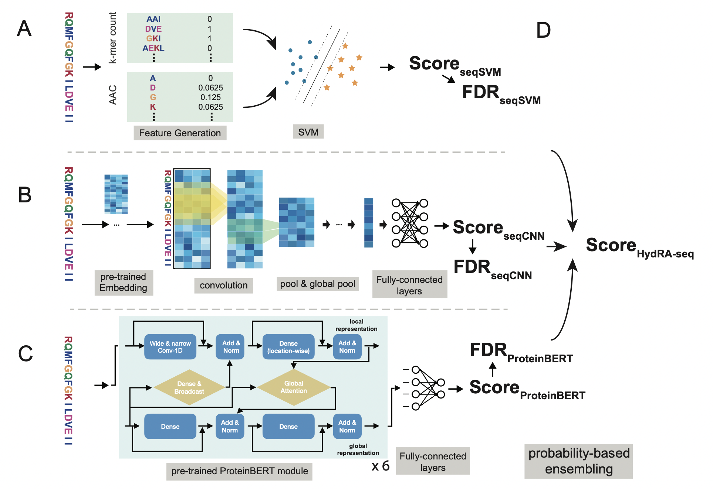
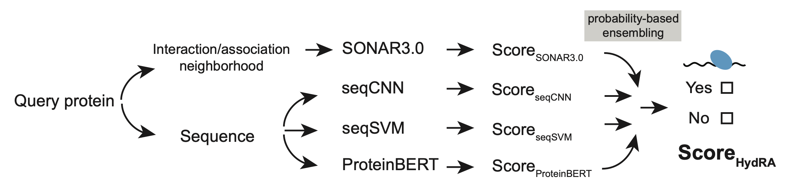

# HydRa: Deep-learning models that predicting RNA-binding capacity from protein interaction association context and protein sequence.
 
 
 

# Installation
HydRa is tested to work under Python 3. Running the following code in your terminal window to install HydRa.

```
pip install pandas numpy networkx scikit-learn tensorflow keras matplotlib setuptools

python3 -m pip install --index-url https://test.pypi.org/simple/ --no-deps hydra-rbp –-upgrade
```
Download the an extra model file (for ProteinBERT-RBP model) under the release menu assets (ProteinBERT_TrainWithWholeProteinSet_defaultSetting_ModelFile.pkl ) into your local directory. (If you are Yeo Lab TSCC user, skip this step.) 

# Prepare the input data
### Protein sequences
The sequence should be stored in FASTA format and one sequence /protein per file. Create a folder under your working directory, and put all the sequence of the query proteins in this folder.  

### Protein-protein interaction/association data (Optional)
The PPI and functional association information should be stored as edge lists using the tab-separated values (.tsv) format. In the tab-separated edge list files, each protein-protein interaction (PPI) or functional association (PPA) is expressed as a row with the proteins shown in an example below. The PPI and PPA information are stored separately in two .tsv files (shown as PPA_edgelist.tsv and PPI_edgelist.tsv in the example below).
```
P06241  P40337
Q99728  P38398
P09012  O14920
Q16665  P40337
Q09472  P04637
P22681  Q02750
Q00987  P04637
Q13546  P42345
P62993  P22681
Q01094  Q6P2Q9
Q86UP2  Q14145
Q6R327  P42345
P45983  Q9Y3T9
```

An example of the input data directory is shown below. 
```
.
├── PIA_edgelist
│   ├── PPA_edgelist.tsv
│   └── PPI_edgelist.tsv
└── sequences
    ├── P06241.fasta
    ├── P09012.fasta
    ├── Q02750.fasta
    ├── Q13546.fasta
    ├── Q6P2Q9.fasta
    ├── Q86UP2.fasta
    └── Q9Y3T9.fasta
```

### Protein region annotation file (For occlusion map, optional)
The annotation file need to be formatted in CSV format as shown below, with each row indicating the coordinates, type, name of the annotated region, and the coloring scheme (optional) for the annotations.
 


# RBP prediction
Run the following command by replacing the parts in the upper case, such as the location of your folder that contains the fasta files of your query proteins `/PATH/TO/FASTA_FILE_FOLDER`, the location where you want to store the output files `/PATH/TO/OUTPUT_FOLDER`, the location of the ProteinBERT-RBP model file you downloaded previously `/PATH/TO/PROTEINBERT-RBP-MODEL`, and a customized name for this prediction `MAKE_A_NAME_FOR_THE_PREDICTION` (optional). For predictions with PPI/PPA data, the file path for the PPI and PPA data is also needed. For Yeo lab TSCC user, you could use the `/home/wjin/projects/RBP_pred/RBP_identification/HydRa2.0/data/ProteinBERT/ProteinBERT_TrainWithWholeProteinSet_defaultSetting_ModelFile.pkl` on TSCC for `/PATH/TO/PROTEINBERT-RBP-MODEL` instead.

(1)	Predicting protein sequences only. (On TSCC)

```
HydRa2_predict --seq_dir /PATH/TO/FASTA_FILE_FOLDER \ 
--proteinBERT_modelfile /home/wjin/projects/RBP_pred/RBP_identification/HydRa2.0/data/ProteinBERT/ProteinBERT_TrainWithWholeProteinSet_defaultSetting_ModelFile.pkl \ 
--outdir /PATH/TO/OUTPUT_FOLDER \ 
-n MAKE_A_NAME_FOR_THE_PREDICTION \ 
--no-PIA --no-PPA
```

(2)	Predicting with protein-protein interaction (PPI), protein-protein association(PPA) data and protein sequences.

```
HydRa2_predict --seq_dir /PATH/TO/FASTA_FILES \ 
--proteinBERT_modelfile /PATH/TO/PROTEINBERT-RBP-MODEL \ 
--outdir /PATH/TO/OUTPUT_FOLDER \ 
-n MAKE_A_NAME_FOR_THIS_PREDICTION \ 
--PPI_edgelist PATH/TO/PPI_EDGE_LIST \
--PPA_edgelist PATH/TO/PPA_EDGE_LIST
```

# Occlusion Map analysis
Run the following command by replacing the parts in the upper case, such as the location of your folder that contains the fasta files of your query proteins `/PATH/TO/FASTA_FILES`, the location where you want to store the output files `/PATH/TO/OUTPUT_FOLDER`, the location of the ProteinBERT-RBP model file you downloaded previously `/PATH/TO/PROTEINBERT-RBP-MODEL`, and a customized name for this prediction `MAKE_A_NAME_FOR_THE_PREDICTION` (optional). If the annotation track (showing the distribution of specific types of features, e.g. protein domain, disordered region, etc., along the protein sequence), the file path for the protein region annotation file `/PATH/TO/PROTEIN_REGION_ANNOATION_FILE` is also needed. For Yeo lab TSCC user, you could also use the `/home/wjin/projects/RBP_pred/RBP_identification/HydRa2.0/data/ProteinBERT/ProteinBERT_TrainWithWholeProteinSet_defaultSetting_ModelFile.pkl` on TSCC for `/PATH/TO/PROTEINBERT-RBP-MODEL` instead.

```
occlusion_map3 -s /PATH/TO/FASTA_FILES \ 
--out_dir /PATH/TO/OUTPUT_FOLDER \  
--proteinBERT_modelfile /PATH/TO/PROTEINBERT-RBP-MODEL \ 
-n MAKE_A_NAME_FOR_THE_PREDICTION \ 
--annotation_file /PATH/TO/PROTEIN_REGION_ANNOATION_FILE
```
